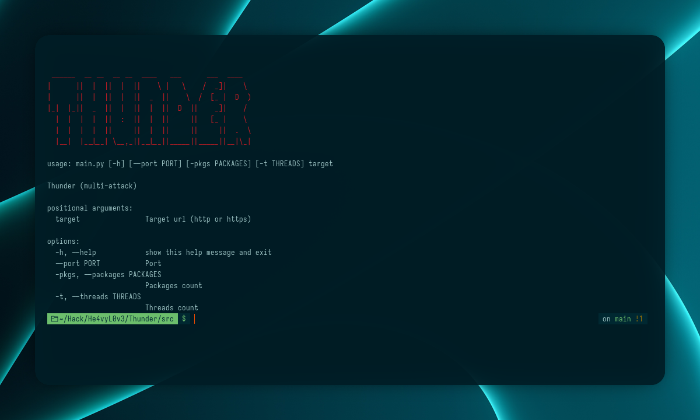

# Thunder



Thunder is a multi-threaded network stress-testing tool for HTTP and network-layer attacks. It is designed for developers and security researchers to test the resilience of their own services. Thunder now supports simultaneous execution of multiple attack types and logs all progress and results via Python's logging module.

## Features
- Simultaneous execution of:
  - HTTP Flood (multi-threaded GET requests)
  - SYN Flood (TCP SYN packets, requires root)
  - UDP Flood (UDP packet spam)
  - ICMP Flood (Ping flood, requires root)
  - Slowloris (many slow HTTP connections)
- All progress and results are logged via logging
- Threaded execution for each attack type
- Randomized User-Agent for HTTP requests
- Simple CLI interface

## Requirements
- Python 3.7+
- scapy (for SYN/ICMP attacks)
- Root privileges for SYN and ICMP attacks
- Linux recommended


## Usage
```sh
sudo python3 src/main.py <target_url> -p <total_packets> -t <threads>
```
- `<target_url>`: Target URL (http or https)
- `-p`, `--packages`: Total number of packets/requests (will be split between attacks, default: 1000)
- `-t`, `--threads`: Number of threads per attack (default: 10)

### Example
```sh
sudo python3 src/main.py https://example.com -p 10000 -t 20
```

## How it works
- The total number of packets/requests is divided equally among all attack types.
- Each attack runs in its own thread pool.
- All progress and results are output via logging.
- HTTP Flood uses randomized User-Agent for each request.


## Attack Types
- **HTTP Flood**: Multi-threaded HTTP GET requests.
- **SYN Flood**: Sends raw TCP SYN packets (requires root, scapy).
- **UDP Flood**: Sends UDP packets to the target port.
- **ICMP Flood**: Sends ICMP Echo (ping) packets (requires root, scapy).
- **Slowloris**: Opens many slow HTTP connections and periodically sends headers.

## Limitations
- SYN and ICMP attacks require root privileges and scapy.
- DNS/NTP amplification not implemented.
- For legal use only (see disclaimer).

## License
MIT License. See [LICENSE](LICENSE).

## Disclaimer
This tool is intended for legal use only, such as testing your own services or with explicit permission. The author is not responsible for any misuse.
