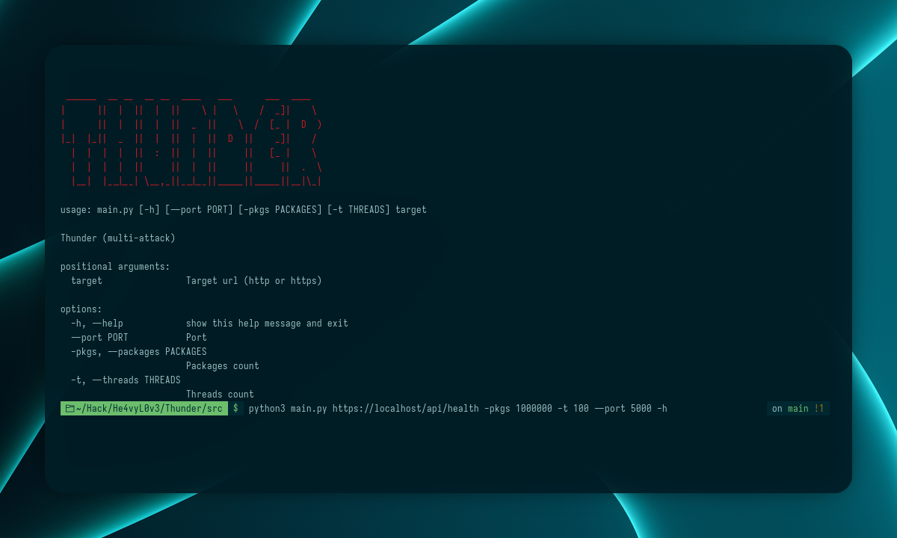
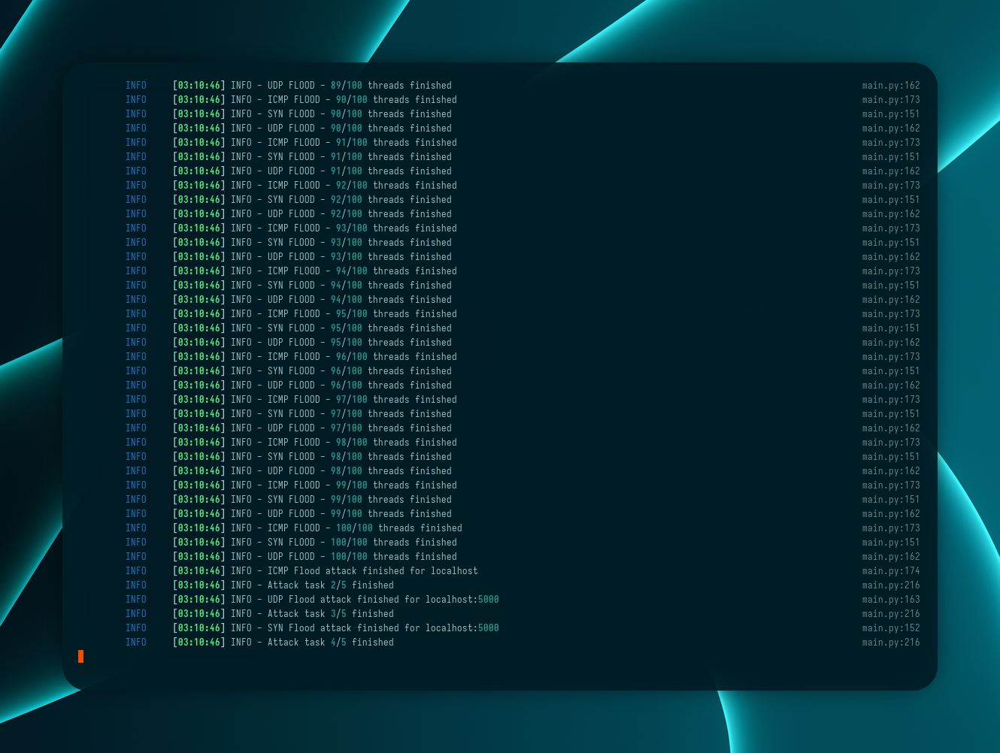

# Thunder


> Thunder is a multi-threaded HTTP load testing tool designed for stress-testing web services. It supports proxy rotation, automatic method detection (GET/POST), and provides real-time progress feedback. This tool is intended for developers and security researchers to test the resilience of their own services.

## Usage
Run the tool from the command line:
```sh
python src/main.py <target_url> [options]
```

### Arguments
- `target_url` (required): The URL of the target service to test.
- `-p`, `--packages`: Number of requests to send (default: 10000)
- `-t`, `--threads`: Number of concurrent threads (default: 1)

### Example
```sh
python src/main.py https://example.com -p 5000 -t 10
```

## Proxy Support
- Place your proxies in `src/proxy_list.txt`, one per line, in the format:
  ```
  ip:port
  ```
- Both HTTP and HTTPS proxies are supported.
- The tool will automatically check proxies for availability before use.

## How it works
1. Loads and checks proxies from `proxy_list.txt`.
2. Detects if the target supports GET or POST requests.
3. Launches multiple threads to send requests, each using a random working proxy.





## License
This project is licensed under the MIT License. See the [LICENSE](LICENSE) file for details.

## Disclaimer
This tool is intended for legal use only, such as testing your own services or with explicit permission. The author is not responsible for any misuse.
